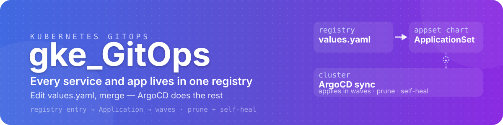

<div align="center">



[](https://github.com/jomakori/gke_GitOps/actions/workflows/helm_lint-test.yaml)
[](https://github.com/jomakori/gke_GitOps/actions/workflows/image-builds.yaml)
[](https://kubernetes.io)
[](https://helm.sh)
[](https://argo-cd.readthedocs.io)
[](https://developer.hashicorp.com/terraform)

</div>


Terraform provisions the cluster and bootstraps ArgoCD; **everything after that bootstrap is owned here** — services, apps, ingress and secret wiring — and ArgoCD keeps the cluster in sync with this repository, not with anything applied by hand.

<details open>
<summary>Table of contents</summary>

<!--TOC-->

- [Layout](#layout)
- [Quickstart](#quickstart)
- [How delivery works](#how-delivery-works)
- [Services](#services)
- [Apps](#apps)
- [Secrets](#secrets)
- [CI](#ci)
- [Troubleshooting](#troubleshooting)

<!--TOC-->

</details>

## Layout

```text
.
├── services/        ← third-party software we host (charts + the registry)
├── apps/            ← first-party workloads we build or test (charts + the registry)
├── .assets/images/  ← images we build for the cluster
├── .useful-scripts/ ← validation, rendering and cluster helpers
├── .github/workflows/ ← CI: chart lint/test, image builds
├── ct_check.sh      ← chart lint/dry-run entrypoint
├── renovate.json    ← dependency updates
└── .pre-commit-config.yaml ← local hooks CI also runs
```

[`services/README.md`](services/README.md) and [`apps/README.md`](apps/README.md) cover their registries, chart patterns and gateway/secret wiring in detail.

## Quickstart

```bash
./ct_check.sh --dir services/helm/<chart>          # lint + template + dry-run, the way CI does it
.useful-scripts/helm_render_and_kubeconform.sh     # render + schema validation
.useful-scripts/validate_mcp_manifest.sh           # chart policies that must not regress
pre-commit install && pre-commit run --all-files   # the hooks CI also runs
```

Prerequisites: `kubectl`, `helm`, chart-testing (`ct`), `yamllint`.

Charts are validated locally and never applied by hand — merging is what deploys. Need a peek at something running without exposing it?

```bash
kubectl port-forward -n <namespace> svc/<service> 8080:80
```

## How delivery works

```text
Terraform (devops_Terraform)
  ├─ provisions the cluster + ArgoCD
  └─ creates the root Application ─┬─▶ services/argocd-appset ─┐
                                   │                            ├─▶ one Application
                                   └─▶ apps/argocd-appset     ─┘     per registry entry
                                                                            │
                                                              ArgoCD applies in waves
                                                              (prune + self-heal)
```

- **Terraform owns the bootstrap** — the cluster, ArgoCD, and the root `Application` that points here. It also injects the values every entry inherits (`repoUrl`, `targetRevision`, `clusterDomain`, `argoProject`, `argoNamespace`).
- **App-of-Apps** — each appset is a chart whose single template renders one `Application` per entry in its `values.yaml`. That file **is the registry**: adding a workload is an entry, not a hand-written manifest.
- **Waves are dependency tiers**, applied in order, so dependencies line up by construction — secrets before their consumers, an operator before its custom resources, a CRD before anything using it, shared platform before workloads:

  | Wave | Tier | Examples |
  |---|---|---|
  | 0 | Foundation | storage class, certificate manager, metrics server, VPA |
  | 1 | Secrets | external-secrets |
  | 2 | Core networking | service mesh (CRDs → control plane → gateway), overlay network |
  | 3 | Edge ingress | the public tunnel |
  | 4 | Operators & DNS | database operator, DNS automation |
  | 5 | Data, observability & platform | database clusters, monitoring stack, the AI platform |
  | 6 | Consumer workloads | end-user services and apps |

- **Wiring is generated from the same entry** — `gateways:` produces the ingress objects and `dopplerConfig` produces the ExternalSecret, so a workload and its exposure are declared once.
- **Merging is deploying.** ArgoCD prunes and self-heals; nothing is applied imperatively.

## Services

Third-party software we host, registered in [`services/argocd-appset/values.yaml`](services/argocd-appset/values.yaml). The registry — not this README — owns enablement, wave and parameters; its entries are grouped by the wave tiers above.

Most charts take their upstream from the project's official chart when one exists; when it does not, we wrap a maintained community chart as a values-override layer (see [`services/README.md`](services/README.md#helm)).

The AI platform has its own documentation: [`services/helm/openagent/README.md`](services/helm/openagent/README.md).

## Apps

First-party workloads we build or test, registered in [`apps/argocd-appset/values.yaml`](apps/argocd-appset/values.yaml). Most use the parameterized chart in `apps/helm/`; workloads needing their own resources carry their own chart — the registry entry names which, so both shapes register the same way.

`openkite-preview` adds per-PR preview environments: a GitHub-PR-driven `ApplicationSet` creates one preview per open PR and tears it down when the PR closes. Details in [`apps/README.md`](apps/README.md).

## Secrets

Nothing sensitive lives in this repository.

1. Values live in **Doppler** (project + config pairs).
2. **Terraform** stores the ESO token as a Kubernetes Secret.
3. A **ClusterSecretStore** per Doppler config references that token.
4. Each workload's **ExternalSecret** pulls that whole config (`dataFrom.extract`) — Kubernetes key names match Doppler key names.
5. Pods consume via `envFrom` / `secretKeyRef`.

| Doppler config | Used by |
|---|---|
| `svc_grafana` | monitoring / Grafana |
| `svc_cloudflare` | service mesh ingress, DNS automation, the tunnel |
| `svc_postgres_operator` | the database operator |
| `svc_argocd` | the PR-preview generator |
| `svc_openagent` | the AI platform |

Add a new secret in Doppler; the ExternalSecret syncs the whole config on its refresh interval.

## CI

| Workflow | What it checks |
|---|---|
| `helm_lint-test.yaml` | yamllint, chart lint/dry-run, render + schema validation, chart unit tests, chart policies, selector guard |
| `image-builds.yaml` | builds and publishes the images under `.assets/images/` when their sources change |

Renovate opens dependency-update PRs. The same validations run locally through pre-commit, so a CI failure is something you can reproduce before you push.

## Troubleshooting

- **A failed sync does not retry by itself** — ArgoCD spends the retry budget on the failure; re-sync or push a change.
- **`OutOfSync` on selectors** — a chart's `selector.matchLabels` must be a subset of its pod template labels; the selector guard in CI exists for exactly this.
- **A manual secret edit disappears** — ExternalSecrets own their keys; change the value in Doppler.
- **Ingress does not route** — host matching is SNI-based; a host outside the Certificate/Gateway never matches, even when DNS resolves.
- **A custom resource fails to apply** — its operator or CRD sits in a later wave than the resource; move the entry up a tier.

Sibling repository: [devops_Terraform](https://github.com/jomakori/devops_Terraform) provisions the clusters and the ArgoCD bootstrap.
