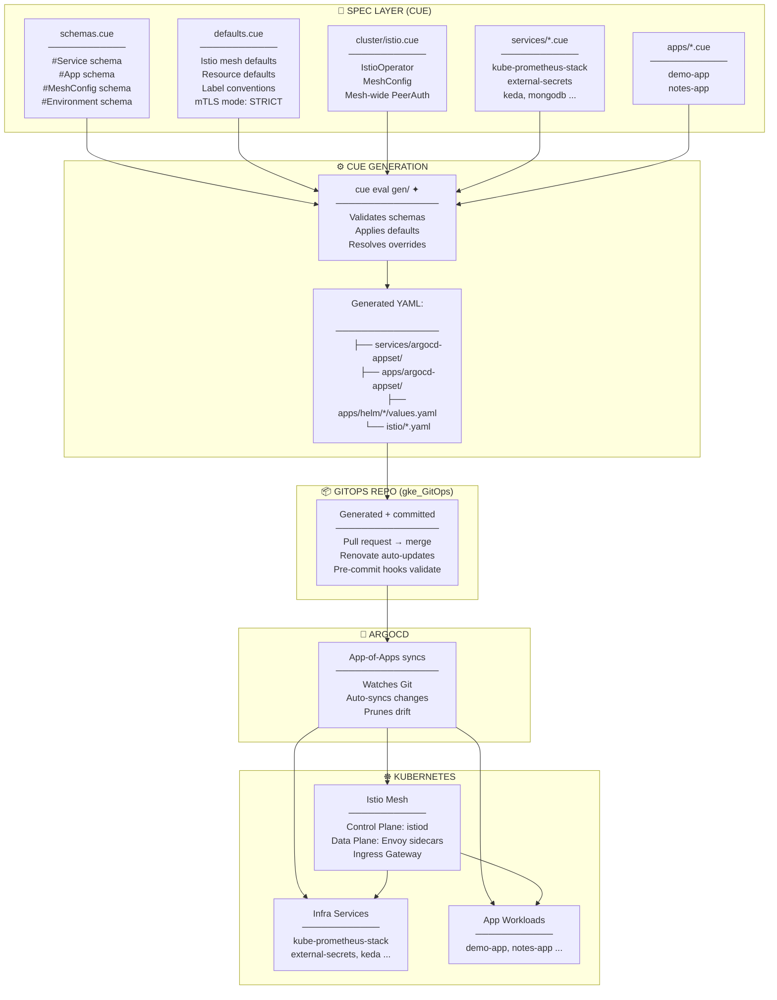
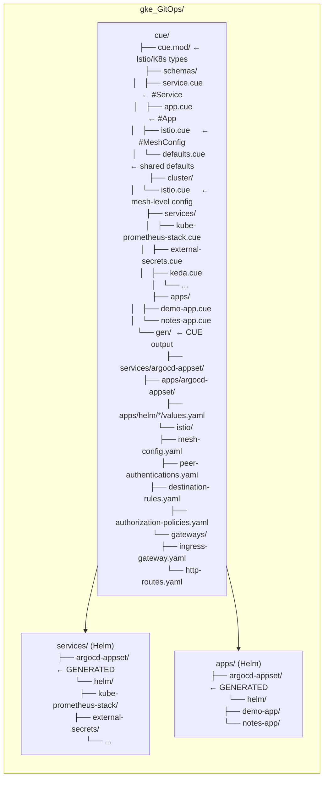
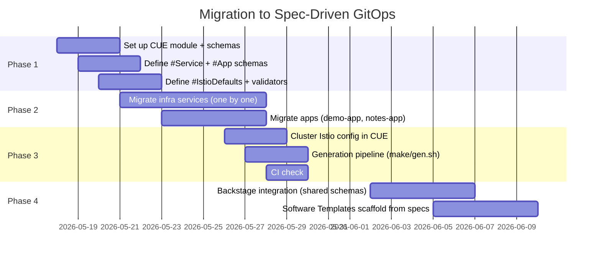

# Spec-Driven GitOps Architecture (v2)

## Architecture Flow



---

## Repository Structure



---

## Spec Schemas

### #Service — for infrastructure (3rd-party Helm charts)

```cue
// cue/schemas/service.cue
#Service: {
  name:       string
  namespace?: string | *name   // defaults to name
  chart: {
    repository: string          // helm repo URL
    name:       string
    version?:   string
    alias?:     string
  }
  enabled:     bool | *true
  syncWave:    int | *0
  values: {...}                 // arbitrary helm values
  mesh?: {                     // optional Istio integration
    mtls?:                     // per-service mTLS override
    authorization?: {...}
  }
}
```

### #App — for workload applications

```cue
// cue/schemas/app.cue
#App: {
  name:        string
  namespace:   string
  enabled:     bool | *true
  ports: [...#Port]
  mesh: {                              // Istio config (required for apps)
    mtls:           "STRICT" | "PERMISSIVE" | "DISABLE" | *"STRICT"
    retries:        int | *3
    timeout:        string | *"30s"
    circuitBreaker?: #CircuitBreaker
    loadBalancer?:   "ROUND_ROBIN" | "LEAST_CONN" | "RANDOM" | *"ROUND_ROBIN"
    trafficRouting?: #TrafficRouting   // canary, A/B, mirroring
    authorization?: [#AuthorizationPolicy]
  }
  ingress?: {                          // north-south exposure
    host:     string
    paths: [...#IngressPath]
    tls?:     #TLS
  }
  environments: [...#Environment]
  resources: #Resources
}

#Resources: {
  requests?: {
    cpu:    string | *"256m"
    memory: string | *"256Mi"
  }
  limits?: {
    cpu:    string | *"500m"
    memory: string | *"512Mi"
  }
}
```

### Defaults — cluster-wide

```cue
// cue/schemas/defaults.cue
#IstioDefaults: {
  meshConfig: {
    enableTracing:          true
    defaultConfig: {
      terminationDrainDuration: "30s"
      proxyMetadata: {
        ISTIO_META_DNS_CAPTURE: "true"
      }
    }
  }
  // Applied to ALL namespaces unless overridden
  peerAuthentication: {
    mtls: mode: "STRICT"
  }
}
```

---

## Per-Component Spec Examples

### Service spec (kube-prometheus-stack)

```cue
// cue/services/kube-prometheus-stack.cue
kubePrometheusStack: #Service & {
  name:    "kube-prometheus-stack"
  enabled: true
  syncWave: 1
  
  chart: {
    repository: "https://prometheus-community.github.io/helm-charts"
    name:       "kube-prometheus-stack"
    version:    "62.0.0"
  }
  
  values: {
    defaultRules: {
      create: true
      rules: { etcd: false, kubeScheduler: false }
    }
    alertmanager: { service: { port: 15010 } }
    // ... rest of values
  }
}
```

### App spec (demo-app)

```cue
// cue/apps/demo-app.cue
demoApp: #App & {
  name:      "demoapp"
  namespace: "demo-app"
  enabled:   true
  
  ports: [{ port: 3000, protocol: "HTTP" }]
  
  mesh: {
    mtls:             "STRICT"
    retries:          3
    timeout:          "15s"
    circuitBreaker: {
      maxConnections: 100
      maxRequests:    1000
      maxRetries:     3
    }
    loadBalancer: "LEAST_CONN"
  }
  
  ingress: {
    host: "demo.jmak.dev"
    paths: [{ path: "/", type: "PathPrefix", backend: 3000 }]
    tls: { secretName: "demo-tls" }
  }
  
  environments: [
    {
      name:       "staging"
      namespace:  "staging-demo-app"
      host:       "staging.demo.jmak.dev"
      dopplerToken: ""  // injected by Terraform
      image: {
        repository: "123456.dkr.ecr.us-east-2.amazonaws.com/demoapp"
        tag: "latest"
      }
    },
    {
      name:       "production"
      namespace:  "prod-demo-app"
      host:       "demo.jmak.dev"
      dopplerToken: ""
      image: {
        repository: "123456.dkr.ecr.us-east-2.amazonaws.com/demoapp"
        tag: "latest"
      }
    }
  ]
  
  resources: {
    requests: { cpu: "256m", memory: "256Mi" }
    limits:   { cpu: "500m", memory: "512Mi" }
  }
}
```

### Cluster-level Istio config

```cue
// cue/cluster/istio.cue
istio: {
  // ── Installation ──
  operator: {
    profile: "default"
    components: {
      ingressGateways: [{ name: "istio-ingressgateway", enabled: true }]
      egressGateways:  [{ name: "istio-egressgateway", enabled: false }]
    }
    meshConfig: #IstioDefaults.meshConfig
  }
  
  // ── Mesh-wide policies ──
  defaultPeerAuthentication: {
    apiVersion: "security.istio.io/v1beta1"
    kind:       "PeerAuthentication"
    metadata: {
      name:      "default"
      namespace: "istio-system"
    }
    spec: { mtls: { mode: "STRICT" } }
  }
  
  // ── Shared ingress gateway ──
  ingressGateway: {
    apiVersion: "gateway.networking.k8s.io/v1"
    kind:       "Gateway"
    metadata: { name: "shared-ingress", namespace: "istio-ingress" }
    spec: {
      gatewayClassName: "istio"
      listeners: [{
        name:     "http"
        port:     80
        protocol: "HTTP"
        allowedRoutes: { namespaces: { from: "All" } }
      }, {
        name:     "https"
        port:     443
        protocol: "HTTPS"
        tls: { mode: "Terminate", credentialName: "shared-cert" }
        allowedRoutes: { namespaces: { from: "All" } }
      }]
    }
  }
}
```

---

## What Gets Generated

| Spec Input | Generated Output | Target |
|---|---|---|
| `cluster/istio.cue` | `istio/mesh-config.yaml` | IstioOperator CR |
| `cluster/istio.cue` | `istio/peer-authentications.yaml` | Mesh-wide PeerAuthentication |
| `cluster/istio.cue` | `istio/gateways/shared-ingress.yaml` | Ingress Gateway |
| `apps/demo-app.cue` | `apps/argocd-appset/templates/demo-app.yaml` | ArgoCD Application |
| `apps/demo-app.cue` | `apps/helm/demo-app/values.yaml` | Helm values |
| `apps/demo-app.cue` | `istio/destination-rules/demo-app.yaml` | DestinationRule |
| `apps/demo-app.cue` | `istio/peer-authentications/demo-app.yaml` | Namespace PeerAuth |
| `apps/demo-app.cue` | `istio/authorization-policies/demo-app.yaml` | AuthorizationPolicy |
| `apps/demo-app.cue` | `istio/virtual-services/demo-app.yaml` | VirtualService/HTTPRoute |
| `services/kube-prometheus-stack.cue` | `services/argocd-appset/templates/kube-prometheus-stack.yaml` | ArgoCD Application |

---

## Incremental Migration Path


